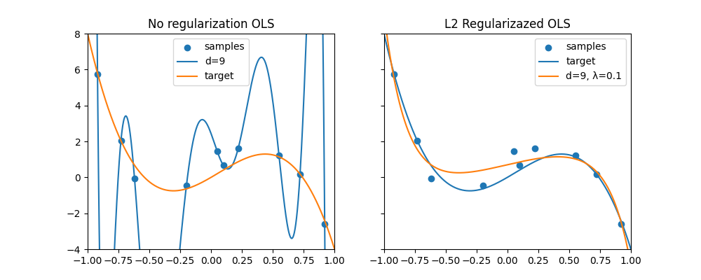

# Revisiting the Polynomial Curve Fitting Problem
The canonical example of successful regularization is the problem of polynomial curve fitting. Despite how well known the this problem is, researchers still discuss what type of regularization one should use. 

## Ridge Regularization
In the below a 9'th order polynomial is fitted to 10 datapoints.

Unsurprisingly, the unregularized fit matches the datapoints very well, but it is too wiggly to be a plausible target function. Applying a slight penalty $\lambda=0.1$ to the size of the parameters $w_0\dots w_9$ in the ridge optimization problem
$$
\text{argmin}_\textbf{w} \sum_{i=1}^n \left(f(x) -y_i\right) + \lambda \|\textbf{w}\|_2^2
$$

yields a much better solution despite the flexibility of the 9'th order polynomial function-class 
$$
\mathcal{F} := \left\{f:\mathbb{R}\mapsto\mathbb{R}| f(x) = \phi(x)^T\textbf{w} = \sum_{i=0}^9 w_i x^{i}\right\},
$$
where $\phi(x):= [1, x, ..., x^d]^T$ is called the basis. The intuitive explanation for why regularization works is that the norm-penalty discurages wiggly solutions. 

## Regularization as Parameter Priors 
A Bayesian perspective on ridge regression found in Bishop's Pattern Recognition and Machine Learning is that the ridge solution is the MAP estimate when assuming the prior $\textbf{w} \sim \mathcal{N}(0, \frac{1}{\lambda} I)$ and a Gaussian noise-model $\varepsilon_1 \dots \varepsilon_n \overset{iid}{\sim}\mathcal{N}(0, \sigma^2)$ st. $y_i = f(x_i) + \varepsilon_i$. In this case we have
$
\begin{align}
p(\mathbf{w}|\mathbf{x}, \mathbf{y}, \sigma^2)
&\propto
\log \prod_{i=1}^n p(y_i|x_i, \mathbf{w}, \sigma^2) p(\mathbf{w})\\
&\propto
\sum_{i=1}^n \left(f(x) -y_i\right) + \lambda \|\textbf{w}\|_2^2.
\end{align}
$
One notable feature about the prior $\textbf{w} \sim \mathcal{N}(0, \frac{1}{\lambda} I)$ is that it uniform across $w_0...w_d$. However, if the goal of introducing regularization is to favor simple (smooth) solutions, then why not let the penalty increase with the degree of the polynomial? That is, we choose $\lambda_0 < ... < \lambda_d$ and solve
$$
\text{argmin}_\textbf{w} \sum_{i=1}^n \left(f(x) -y_i\right) + \sum_{j=1}^d \lambda_j w_j^2. 
$$
This type of regularization is order-dependent. [A recent paper](https://arxiv.org/abs/2503.02113) argued (as an aside) that this type of regularization is preferable to the ridge-penalty, as it has a prior that favors simpler functions. Let us check this claim using polynomial curve fitting as an example. 

## Is the order-dependent prior... better? 
One way to measure the $\textit{wigglyness}$ of a function $f$ the squared second derivative, which for our function-class is
$$
(f''(x))^2 = \left(\sum_{i=2}^d i(i-1) w_i x^{i-2}\right)^2.
$$
Luckily, by the independence $\forall i \neq j: \mathbb{E}[w_i w_j]=0$ we get 
$
\begin{align}
    \mathbb{E}[f''(x)]^2
    &=
    \sum_{i=2}^d i^2(i-1)^2 x^{2(i-2)}\mathbb{E}[w_i^2]\\
    &= 
    \sum_{i=2}^d \frac{i^2(i-1)^2}{\lambda_i} \cdot x^{2(i-2)}
\end{align}
$
And since the wigglyness depends on $x$, we could also consider integrating the squared second derivative over the domain to obtain an overall gauge of the wigglyness on the domain. So, defining
$$
R(f):= \int_D [f''(x)]^2 dx
$$
we see that
$
\begin{align}
    \mathbb{E}[R(f)]
    &=
    \sum_{i=2}^d \frac{i^2(i-1)^2}{\lambda_i}\cdot\left(\int_{-1}^1 x^{2(i-2)} dx\right)\\
    &= 
    2\sum_{i=2}^d \frac{i^2(i-1)^2}{\lambda_i(2i-1)}. 
\end{align}
$
Since $i^2(i-1)^2$ grows alot faster than $2i-1$, we can control the wigglyness of the functions favored by the prior using increasing $\lambda_i$-values. 

## The Upshot
In our example of polynomial curvefitting, we see how order-dependent (increasing) regularization in some sense "corresponds" to a prior that favors less wiggly functions compared to the uniform $\ell_2$-regularization prior. This even holds true on the domain $[-1, 1]$ where the higher-order terms are not dominating. So, the effect is even more pronounced on the rest of $\mathbb{R}$.

What is important for generalization is the prior over the function-class $\mathcal{F}$ and what types of functions it favors. It is not always the case that simple priors over the model-parameters induce the intended prior over $\mathcal{F}$. For our 10'th degree polynomial curve-fitting example, expanding the domain from $[-1, 1]$ to, say, $[-10, 10]$ then a naive prior like $\textbf{w} \sim \mathcal{N}(0, I/\lambda)$ would favor extremely wiggly functions. 
